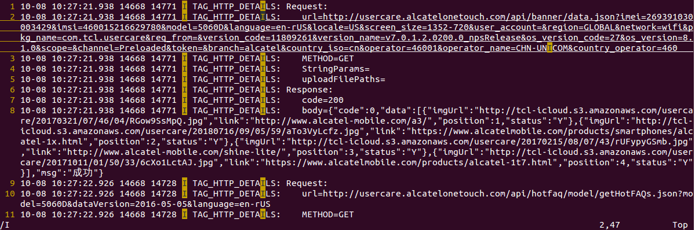
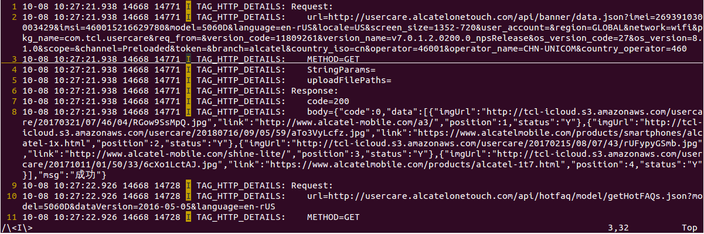

# 搜索模式中的正则表达式

http://www.cnblogs.com/ifantastic/p/3826433.html  (未看完)

- 搜索单词

  Vim中使用 \< 和 \> 分别表示单词的开头和结尾，例如查找单词 i 而不是字母 i ，在正常模式下，按下 / 启动搜索模式，输入 \<i\> ，敲击回车即可。

  要查找当前光标覆盖的单词，敲击 * ，Vim会自动启动搜索模式，光标移动到该单词下一个现身位置。

  例子:

  搜索所有包含大写字母I的内容, 这样搜索出的结果既有单词 I, 又有带有I的字符串

  

  仅搜索所有包含单词I的内容

  


- 搜索A或B

  使用 \| 表示或逻辑，例如 red\|green\|blue 匹配字符串（注意不是单词）red或green或blue。

  如果要将匹配的对象替换成新的字符串，可以使用 :%s/搜索正则/新字符串/g，例如将所有的red或green字符串替换为purple：

  ```shell
  :%s/red\|green/purple/g
  ```

  替换所有单词red或green为单词purple：

  ```shell
  :%s/\<(red\|green)\>/purple/g
  ```

  ​

